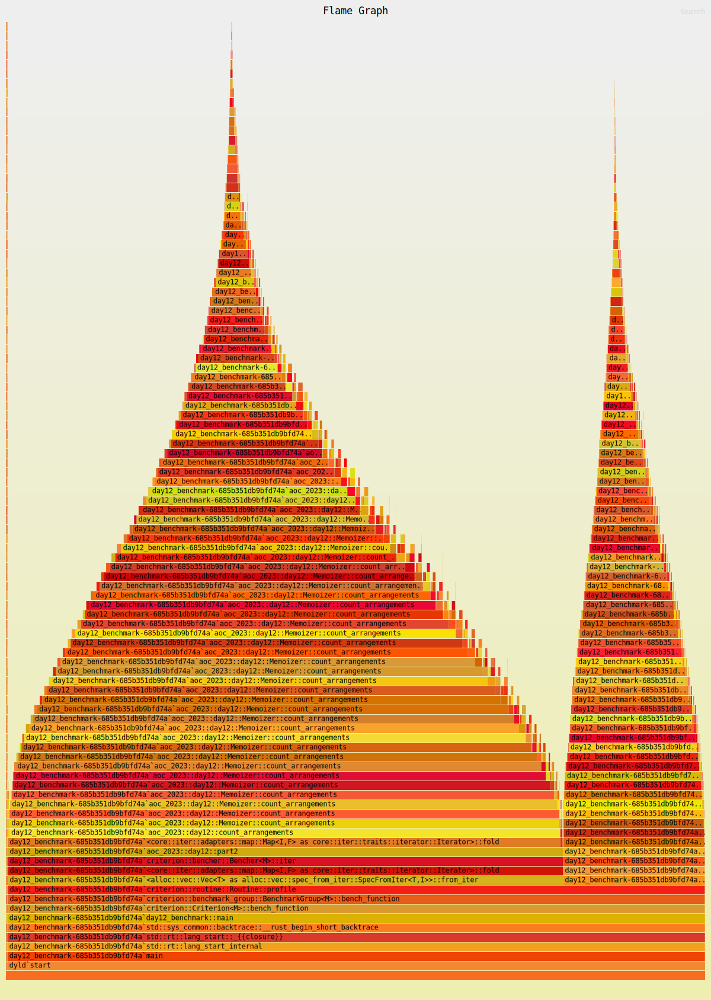
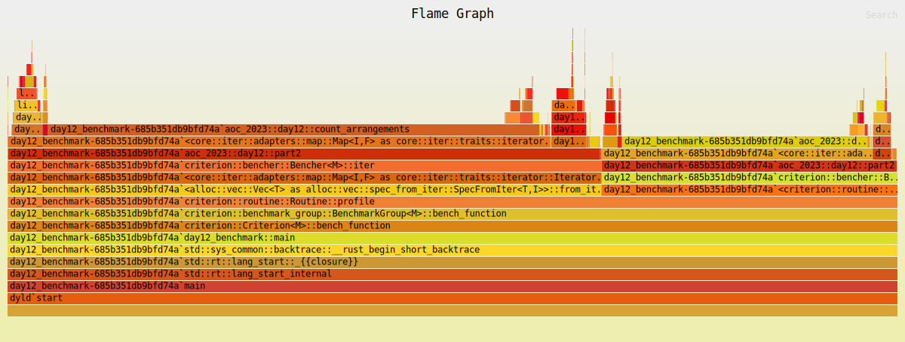

# Solution

For part 1 I used a use-it-or-lose-it recursive function:
```rust
fn count_arrangements(r: &Record) -> usize {
    let mut total = 0;
    count_helper(&mut total, &r.data, &r.counts);
    total
}
fn count_helper(total: &mut usize, data: &[u8], counts: &[usize]) {
    if data.is_empty() {
        if counts.is_empty() {
            *total += 1;
        }
        return;
    }
    if counts.is_empty() {
        if !data.contains(&b'#') {
            *total += 1;
        }
        return;
    }
    if data[0] != b'#' {
        // This is either ground, or unknown. Try skipping it.
        count_helper(total, &data[1..], counts);
    }
    if data[0] != b'.' {
        // This is either damaged, or unknown. Try consuming it.
        if let Some(next) = remove_prefix(data, counts[0]) {
            count_helper(total, next, &counts[1..]);
        }
    }
}

fn remove_prefix(data: &[u8], count: usize) -> Option<&[u8]> {
    if data.len() < count || data[..count].contains(&b'.') {
        return None;
    }
    if data.len() == count {
        return Some(&data[count..]);
    }
    if data[count] == b'#' {
        return None;
    }
    Some(&data[count + 1..])
}
```

# Optimization

The naive recursive solution is too slow for part 2. I initially sped it up by
plugging in a memoization layer. The set of possible inputs to `count_helper` is
small: we're always progressing from the left, so it's always (data[i..],
counts[j..]) for (i, j) in (0..data.len(), 0..counts.len()).

This worked, but it was slow
```
day12/part2             time:   [69.842 ms 70.140 ms 70.489 ms]
```

and the profile indicated that we're bleeding a little bit of time doing hash lookups on each recursive call:



## Speeding it up

First instinct: rather than hashing the `RecordRef` (which is effectively a
`(&[u8], &[usize])`), we can use the `(i, j)` indices directly.

Once we get to a pair of indices, we could use arrays instead of hash tables.

At this point the question is: can we switch from memoization to dyamic
programming (i.e., do we populate the entries in the matrix in a predictable
order)? Here the answer is yes.

```rust
fn count_arrangements(r: &Record) -> usize {
    // D x C matrix of counts
    // memo[d][c] = f(data[..d], counts[..c])
    let mut open = vec![vec![0; r.counts.len() + 1]; r.data.len() + 1];
    let mut closed = vec![vec![0; r.counts.len() + 1]; r.data.len() + 1];

    // The empty input always matches
    open[0][0] = 1;
    closed[0][0] = 1;
    for d in 1..=r.data.len() {
        if r.data[d - 1] != b'#' {
            open[d][0] += open[d - 1][0];
        };
        for c in 1..=r.counts.len() {
            if r.data[d - 1] != b'#' {
                open[d][c] += open[d - 1][c] + closed[d - 1][c];
            }
            let count = r.counts[c - 1];
            if d >= count && r.data[..d].iter().rev().take(count).all(|&ch| ch != b'.') {
                closed[d][c] += open[d - count][c - 1];
            }
        }
    }
    open[r.data.len()][r.counts.len()] + closed[r.data.len()][r.counts.len()]
}
```

This approach is quite a bit faster:
```
day12/part2             time:   [11.034 ms 11.096 ms 11.155 ms]
                        change: [-84.305% -84.181% -84.076%] (p = 0.00 < 0.05)
```

and the profile doesn't indicate much low-hanging fruit.


## Grasping at straws

The last optimizations I can see here are:
- taking advantage of the matrix access patterns
- pre-computing the "do we have enough consecutive damaged cells" calculation

Looking at the code above, we're only ever grabbing `open[...][c]` and
`open[...][c-1]`, so pre-allocating the whole 2-dimensional matrix is overkill.
We can keep only the current and previous rows.

We also don't need to calculate
```
d >= count && r.data[..d].iter().rev().take(count).all(|&ch| ch != b'.')
```
every time.

Taking advantage of these two, we land at
```
day12/part2             time:   [3.3608 ms 3.3666 ms 3.3730 ms]
                        change: [-69.827% -69.658% -69.477%] (p = 0.00 < 0.05)
```

and a pretty uninformative profile
