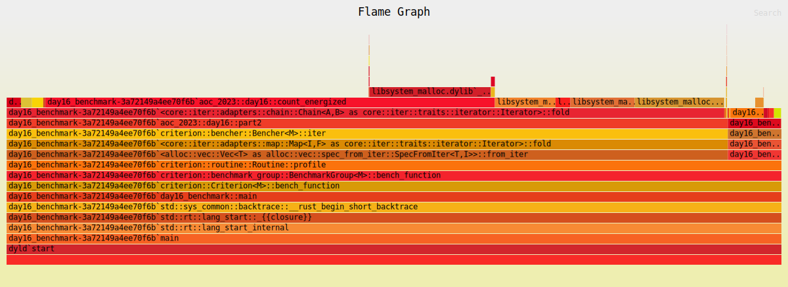

# Solution

For both parts I used depth-first search to simulate the light proliferating
through the grid. I initially used a `HashSet<(Position, Direction)>` to avoid
repeat work.

This was fairly slow
```
day16/part2             time:   [300.35 ms 302.62 ms 305.26 ms]                                                                              
```

and the profile indicated that we're bleeding a lot of time doing HashMap inserts.


## Specialized data structures

The HashSet is more flexible than we need. We know that the `(Position,
Direction)` space has a fixed size: `4 * height * width`. We can use a vector to
represent the whole space.

```rust
struct PosDirSet {
    dims: Dimensions,
    bits: Vec<bool>,
}
impl PosDirSet {
    fn new(dims: Dimensions) -> Self {
        Self {
            bits: vec![false; (4 * dims.height * dims.width) as usize],
            dims,
        }
    }
    fn insert(&mut self, Position(i, j): Position, dir: Direction) -> bool {
        let idx = 4 * (i * self.dims.width + j)
            + match dir {
                Direction::Up => 0,
                Direction::Down => 1,
                Direction::Left => 2,
                Direction::Right => 3,
            };
        let Some(entry) = self.bits.get_mut(idx as usize) else {
            return false;
        };
        if !*entry {
            *entry = true;
            return true;
        }
        false
    }
    fn count_positions(&self) -> usize {
        self.bits
            .chunks(4)
            .filter(|chunk| chunk.iter().any(|&b| b))
            .count()
    }
}
```

This is faster
```
day16/part2             time:   [60.351 ms 60.438 ms 60.549 ms]
                        change: [-80.149% -79.994% -79.848%] (p = 0.00 < 0.05)
```

and the profile no longer shows HashMap operation. But it does still show quite a bit of time spend allocating and freeing memory.



## Reducing allocations

Inside of the DFS loop I was using code like this to de-duplicate the expansion logic:
```rust
let next_dirs = match ch {
    Cell::Ground => vec![dir],
    Cell::MirrorUp /* aka '/' */ => match dir {
        Direction::Up => vec![Direction::Right],
        Direction::Down => vec![Direction::Left],
        Direction::Left => vec![Direction::Down],
        Direction::Right => vec![Direction::Up],
    },
    Cell::MirrorDown /* aka '\' */ => match dir {
        Direction::Up => vec![Direction::Left],
        Direction::Down => vec![Direction::Right],
        Direction::Left => vec![Direction::Up],
        Direction::Right => vec![Direction::Down],
    },
    Cell::SplitHoriz => match dir {
        Direction::Up | Direction::Down => vec![Direction::Left, Direction::Right],
        Direction::Left | Direction::Right => vec![dir],
    }
    Cell::SplitVert => match dir {
        Direction::Up | Direction::Down => vec![dir],
        Direction::Left | Direction::Right => vec![Direction::Up, Direction::Down],
    }
};
for next_dir in next_dirs {
    stack.push((pos.step(next_dir), next_dir));
}
```

I think these very short-lived vectors are the source of the allocations.

I refactored this to use recursion (and thus got rid of the explicit `stack: Vec<_>`, instead relying on the call stack).
```
day16/part2             time:   [20.598 ms 20.672 ms 20.756 ms]
                        change: [-65.936% -65.797% -65.652%] (p = 0.00 < 0.05)
```

Though one downside of highly recursive functions is that they produce messy profiles
