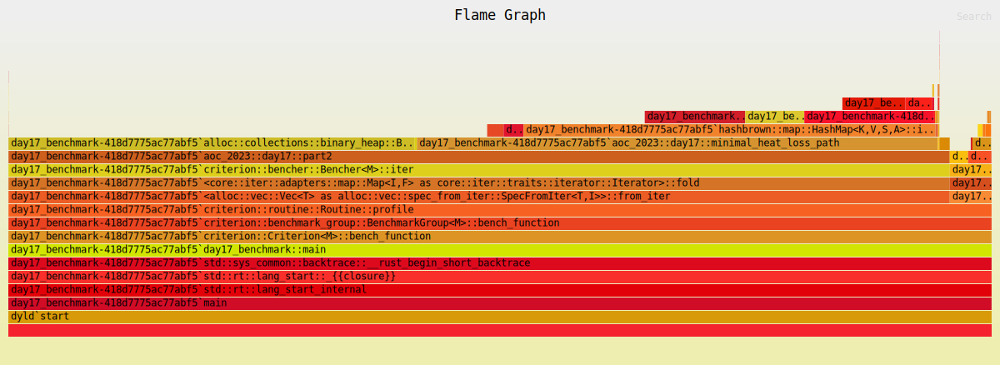
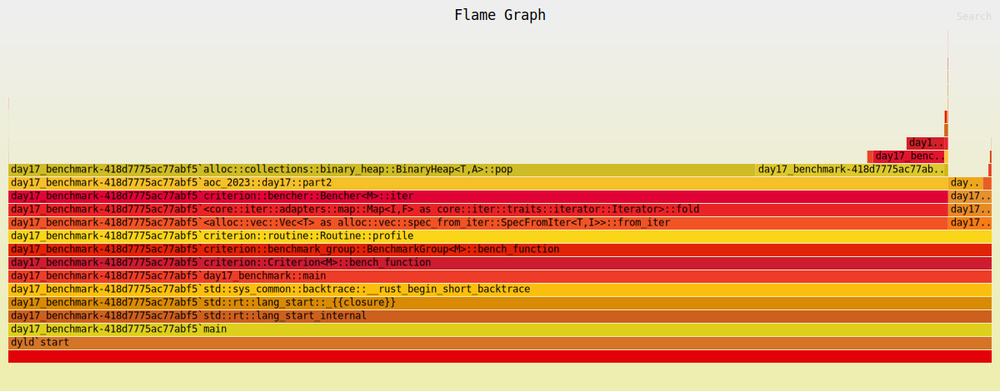

Initial solution based on `BinaryHeap` and `HashSet`:
```
day17/part2             time:   [183.22 ms 186.32 ms 189.80 ms]
```



## Specialize the HashSet

```
day17/part2             time:   [83.661 ms 83.933 ms 84.218 ms]
                        change: [-55.799% -54.953% -54.186%] (p = 0.00 < 0.05)
```



## Specialize the BinaryHeap

```
day17/part2             time:   [19.433 ms 19.549 ms 19.665 ms]
                        change: [-76.867% -76.708% -76.554%] (p = 0.00 < 0.05)
```